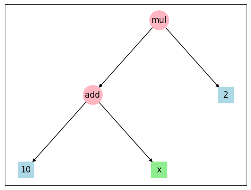

# GX's Genetic Programming

#### *A no-nonsense GP in pure Python*

```python
from gxgp import Node

tree = Node(operator.mul, [Node(operator.add, [Node(10), Node('x')]), Node(2)])
tree.draw()
```



... and then simply:

```python
tree()
TypeError: < lambda > () missing 1 required keyword-only argument: 'x'

tree(x=11)
42
```

#### LICENSE

Copyright © 2024 by [Giovanni Squillero](https://squillero.github.io/) / Politecnico di Torino  
[https://github.com/squillero/programmer-zendo](https://github.com/squillero/programmer-zendo)  
Free under certain conditions — see the license for details.  
